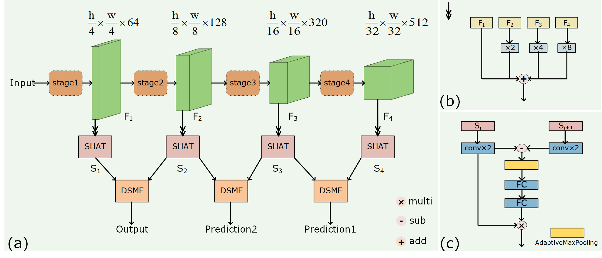
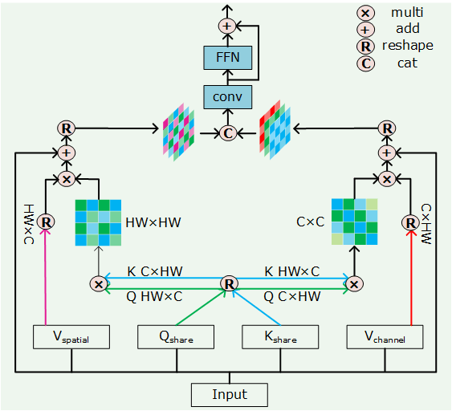
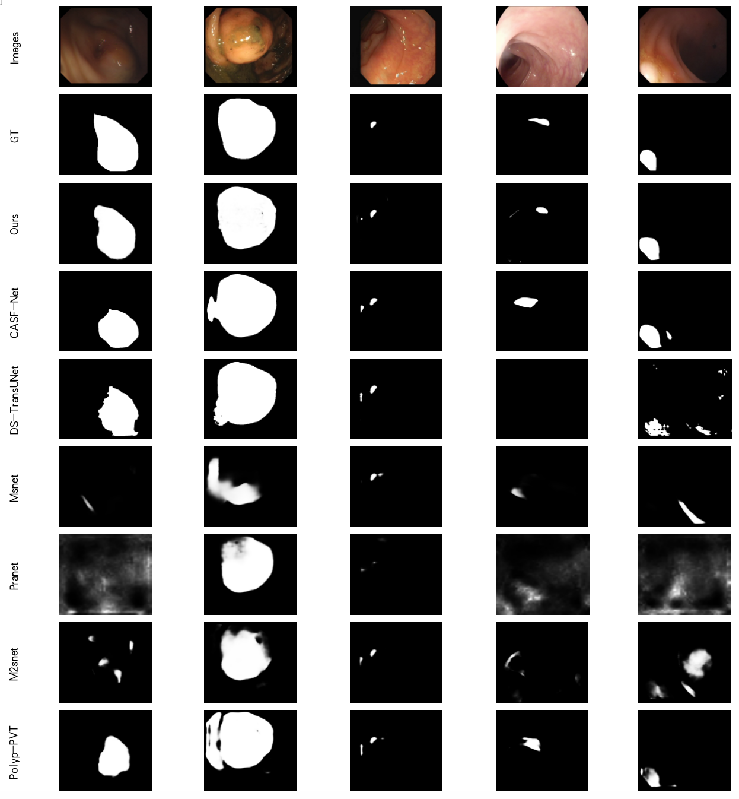

# Shared Hybrid Attention Transformer Network for Colon Polyp Segmentation

## 1. Abstract

In the field of medical imaging, the automatic detection and segmentation of colon polyps is crucial for the early diagnosis of colorectal cancer. Currently, Transformer methods are commonly employed for colon polyp segmentation tasks, often utilizing dual attention mechanisms. However,  these attention mechanisms typically utilize channel attention and spatial attention in a serial or parallel manner, which increases computational costs and model complexity. To address these issues, we propose a Shared Hybrid Attention Transformer (SHAT) framework, which shares queries and keys, thereby avoiding redundant computations and reducing computational complexity. Additionally, we introduce differential subtraction attention module to enhance feature fusion capability and significantly improve the delineation of polyp boundaries, effectively capture complex image details and edge information involved in the colon polyp images comparing with existing techniques. Our approach overcomes the limitations of existing colon polyp segmentation techniques. Experimental results on a large-scale annotated colon polyp image dataset demonstrate that our method excels in localizing and segmenting polyps of various sizes, shapes, and textures with high robustness.

## 2. Architecture
### 2.1 The network architecture of the proposed model.

### 2.2 The architecture of the shared hybrid attention transformer model.

  

## 3. Implementation
The proposed architecture is implemented using the PyTorch framework (1.7.1+cu101) with 2 NVIDIA Tesla T4 with 16 GB Memory. 

### 3.1 Dataset

+ downloading testing dataset, which can be found in this [download link (Google Drive)](https://drive.google.com/file/d/1hwirZO201i_08fFgqmeqMuPuhPboHdVH/view?usp=sharing). It contains five sub-datsets: CVC-300 (60 test samples), CVC-ClinicDB (62 test samples), CVC-ColonDB (380 test samples), ETIS-LaribPolypDB (196 test samples), Kvasir (100 test samples).

+ downloading training dataset , which can be found in this [download link (Google Drive)](https://drive.google.com/file/d/1hzS21idjQlXnX9oxAgJI8KZzOBaz-OWj/view?usp=sharing). It contains two sub-datasets: Kvasir-SEG (900 train samples) and CVC-ClinicDB (550 train samples).

+ downloading pvtv2 weights , which can be found in this [download link (Google Drive)](https://https://drive.google.com/drive/folders/1Eu8v9vMRvt-dyCH0XSV2i77lAd62nPXV). 

## 3. Exemplary images and segmentation results obtained by different approaches. 

## 4. Citation
<pre>
######
</pre>

## 5. License
The source code is free for research and education use only. Any comercial use should get formal permission first.
